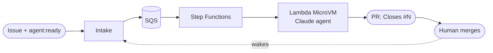

# Salamanda

**Agentic Harness.** A closed loop that turns approved GitHub issues into reviewed pull requests, with an AI
agent working in an isolated AWS Lambda MicroVM.



1. **A human writes an issue** and approves it with the `agent:ready` label.
2. **The loop picks the next eligible issue**, one run at a time, respecting `Depends on: #N` lines and priority labels.
3. **An agent implements it** in a fresh MicroVM, test first, and runs typecheck, lint, tests and build.
4. **It opens a pull request** that `Closes #N`, or comments on the issue explaining why it couldn't.
5. **A human reviews and merges.** The merge wakes the loop for whatever became eligible.

The project it builds today is an **expense tracker** (Next.js, in `app/`).

## Documentation

| | |
|---|---|
| [Overview](docs/overview.md) | What the loop does and the ideas behind it |
| [Architecture](docs/architecture.md) | Components, the life of a run, cadence, design choices |
| [Writing issues](docs/issues.md) | How to feed the loop; dependencies, priority, labels |
| [The worker](docs/worker.md) | Inside one run: the agent, its tools, how a PR is made |
| [Security and guardrails](docs/security.md) | Approval gates, protected paths, isolation, secrets |
| [Operations](docs/operations.md) | Deploy, run, stop, observe, troubleshoot |
| [Configuration](docs/configuration.md) | Every setting, variable and label |
| [Development](docs/development.md) | Layout, checks, CI, running the worker locally |

## Quick start

**Use the loop.** Open an issue with a clear outcome and a definition of done, then add `agent:ready`.
Within a few minutes a PR appears, or a comment saying why not. See [Writing issues](docs/issues.md).

**Work on this repository:**

```bash
npm ci && npm run verify               # app + harness: typecheck, lint, tests, build
(cd agent && uv run pytest -q)         # worker and Lambda tests
```

**Deploy it:** [Operations](docs/operations.md) covers the GitHub App, secrets, `terraform apply`, the
MicroVM image, and turning the schedule on.

## Repository layout

| Path | What it is |
|---|---|
| `app/` | The expense tracker, the only thing the agent changes (`app/src/**`) |
| `agent/` | The worker (Strands agent, tool sandbox, PR publishing) and the AWS Lambdas, in Python |
| `harness/` | `@loop/harness`: the `pr-rules` guardrail every PR must pass |
| `infra/` | Terraform for the AWS side. Humans only: CI validates, a human applies |
| `.github/` | CI, the wake-up workflow, and branch protection |
| `docs/` | Documentation |
| `CLAUDE.md` | The rules the agent follows on every run |

## Guardrails at a glance

- **Approval at both ends.** Only `agent:ready` issues are worked on, and `main` accepts reviewed PRs only,
  with `verify`, `pr-rules` and `agent` passing.
- **The agent can't change its own guardrails.** Protected paths are refused by its tools and by CI, and the
  bot can't push workflow changes at all.
- **Isolated, short-lived runs.** One MicroVM per issue, always terminated. It has no AWS role, and agent-run
  code executes as an unprivileged user without secrets.
- **Failures are loud.** No PR, a labelled issue and an explanatory comment. Re-add `agent:ready` to retry.

**Stopping it:** set `schedule_enabled = false` and `terraform apply`, which also stops wake-ups. Other options
are in [Operations](docs/operations.md#stop).
