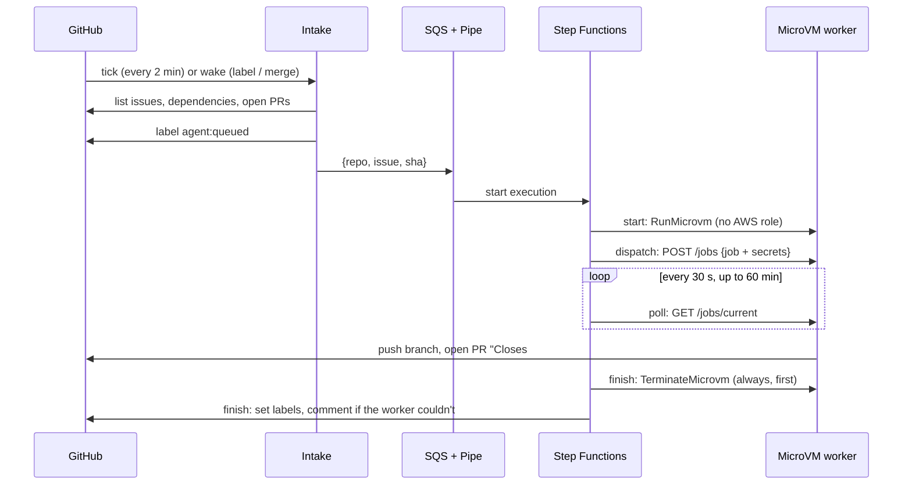

# Architecture

Everything runs in one AWS account and region (`eu-west-1`), plus the GitHub repository.
The AWS side is defined in Terraform under `infra/`, except the MicroVM image, which is built by
`agent/deploy/build_image.py`: Terraform can't set the image's readiness hook.

## Components

| Component | What it is | Job |
|---|---|---|
| **Intake** | Lambda `salamanda-intake` (Python 3.13, arm64) | Decides whether to start a run, and which issue. Queues at most one. |
| **Schedule** | EventBridge Scheduler `salamanda-intake` | Ticks intake every 2 minutes (created disabled; a human enables it) |
| **Wake workflow** | `.github/workflows/wake.yml` + IAM role `salamanda-wake` (GitHub OIDC) | Invokes intake immediately on `agent:ready` labels and pushes to `main` |
| **Backoff record** | SSM parameter `/salamanda/intake-backoff` | Lets idle ticks exit early; resets when there's work |
| **Queue** | SQS FIFO `salamanda-tasks.fifo` + dead-letter queue (with an alarm) | Buffers jobs; deduplicates by `issue-sha` |
| **Pipe** | EventBridge Pipe `salamanda-tasks` | Starts one Step Functions execution per message |
| **run-task** | Step Functions state machine `salamanda-run-task` | Drives one run: start → dispatch → poll → finish |
| **Task Lambdas** | `salamanda-start`, `-dispatch`, `-poll`, `-finish` | The steps of the state machine |
| **Worker** | Lambda MicroVM image `salamanda-worker` (ARM64, Firecracker) | Runs the agent on one issue and opens the PR |
| **Secrets** | Secrets Manager `salamanda/anthropic-api-key`, `salamanda/github-app-private-key` | The model API key and the GitHub App key |
| **GitHub App** | `salamanda-loop` | The bot identity: issues, PRs, pushes; **no** workflows permission |
| **Model** | Claude Opus 5.5 via the Anthropic API (Bedrock supported, currently parked) | Does the reasoning and editing |

## The life of a run

1. **Intake** runs on a tick or a wake-up.
   - It exits early if the loop is disabled, or if the backoff says it isn't time yet.
   - It does nothing while a run is in flight: a running execution, or any open issue labelled
     `agent:queued` or `agent:running`.
   - Otherwise it selects the best eligible issue (see [Writing issues](issues.md)), labels it
     `agent:queued`, and sends `{repo, issue, sha}` to the queue. `sha` is the current head of `main`.
2. **The Pipe** starts a `run-task` execution. It delivers the message as a one-element array, which
   the state machine's `Shape?`/`Unwrap` states normalise.
3. **Start** labels the issue `agent:running`, then calls `RunMicrovm` with the image, a hard
   `maximumDurationInSeconds`, public ingress/egress connectors, and a `clientToken` equal to the
   execution name. The token means a retried Start can never create a second MicroVM.
4. **Dispatch** waits for the MicroVM to be running and healthy. It then reads both secrets from Secrets
   Manager and POSTs the job, secrets included, to the worker over the MicroVM's authenticated HTTPS endpoint.
5. **Poll** asks the worker for `GET /jobs/current` every 30 seconds, for up to 120 polls (60 minutes).
6. **The worker** implements the issue and opens the PR. See [The worker](worker.md).
7. **Finish** always runs, whether the run succeeded, failed, timed out, or crashed at any step.
   1. It terminates the MicroVM first.
   2. It updates the labels, and comments on the issue if the worker couldn't.
   3. It resets intake's backoff, so the next eligible issue starts soon.

## Timing and cadence

| What | Value |
|---|---|
| Intake tick | every 2 minutes |
| Idle backoff | the wait doubles 2 → 4 → 8 → 16 → **32 min** (`intake_sleep_minutes`) |
| Backoff reset | an issue queued, an `agent:ready` label, a push to `main`, or a finished run |
| Typical run | about 3–4 minutes for a small issue |
| Poll limit | 120 polls × 30 s = 60 minutes |
| MicroVM hard cap | `max_run_seconds` = 4500 s (75 minutes), enforced by the platform |

## Why it is built this way

- **Lambda MicroVMs** give each run a fresh, isolated Firecracker VM with a snapshot start of a few
  seconds, with no servers to manage.
- **Step Functions** makes "always terminate" structural rather than a code convention. Every task state
  catches into Finish.
- **SQS + Pipe** decouples choosing an issue from running it, and adds deduplication and a dead-letter queue.
- **No AWS role on the MicroVM.** Inside a MicroVM, any process could read role credentials from the
  metadata endpoint, including agent-written test code. The worker needs only GitHub and Anthropic, and
  those secrets arrive with the job.
- **Polling instead of callbacks.** A callback to Step Functions would need AWS credentials inside the
  MicroVM, which the previous point rules out.
