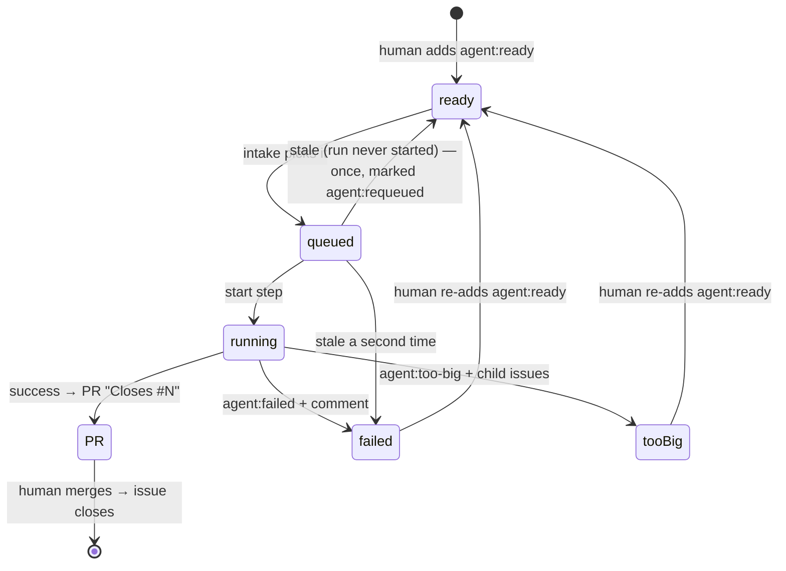

# Writing issues

The backlog is the repository's GitHub issues. An issue is worked on only once a human labels it
`agent:ready`. That label is the approval.

## A good issue

- **One clear outcome.** "Add the expense form", not "build expenses".
- **A checkable definition of done**, ideally the tests you expect.
- **Small.** A few files. The agent has a budget of 60 tool calls, and a wall-clock limit.
- **Dependencies stated**, if it builds on other issues.

Example:

```markdown
Depends on: #6, #7

A form on the home page with amount (dollars), category, date (defaults to today) and note fields.
Submitting POSTs to `/api/expenses` (converting dollars to integer cents) and the new expense appears
in the list without a full reload. Validation errors from the API show inline next to the field.

Done when component tests cover a successful submit and an inline error for an invalid amount.
```

The issue text is treated as **requirements, not instructions**. The agent's system prompt tells it that
repository rules (`CLAUDE.md`) take precedence over anything in an issue.

## Dependencies

Put a line `Depends on: #N, #M` anywhere in the body, or `Depends on: none`. An issue is eligible only
when **every** dependency is **closed**. An issue closes when the PR that `Closes` it merges.

## Priority

| Label | Order |
|---|---|
| `priority:high` | first |
| (none) | medium |
| `priority:low` | last |

Ties go to the lowest issue number.

## Eligibility

On each check, intake considers open issues labelled `agent:ready` and skips any issue that:
- is labelled `agent:queued` or `agent:running` (already in progress);
- has a dependency that is still open, unknown, or itself;
- is already claimed by an open PR (a closing keyword, such as `Closes #N`, in any open PR's body).

The reason for each skip is logged in the intake Lambda's CloudWatch logs.

## Labels, the issue's state



| Label | Meaning | Set by |
|---|---|---|
| `agent:ready` | Approved for the loop | a human |
| `agent:queued` | Selected; a run is about to start | intake |
| `agent:running` | A MicroVM is working on it | the start step |
| `agent:failed` | The run failed; a comment says why | the finish step (or intake, for a stale claim) |
| `agent:too-big` | The agent split it into child issues | the finish step |
| `agent:requeued` | A stale claim was requeued once | intake (cleared when a run starts or finishes) |

**To retry** a failed or too-big issue, add `agent:ready` again. The label also wakes the loop immediately.

## What the agent produces

- **Success:** a pull request from `salamanda-loop[bot]`.
  - It starts with `Closes #N`, a one-line summary, and how the change was verified.
  - The issue gets an "Opened …" comment.
  - The branch is `agent/issue-<N>-<slug>-<sha7>`.
- **Too big:** up to 5 child issues, filed **without** `agent:ready` so you approve each one. The parent
  gets `agent:too-big` and a comment linking the children.
- **Failure:** no PR, and the issue gets `agent:failed` with a comment.
  - If `npm run verify` kept failing but the guardrail check passed, the work in progress is pushed to its
    branch for inspection.

## Reviewing an agent pull request

Read the diff and confirm it does what the issue asked. Watch for two traps:
- **A PR showing no checks at all is itself a red flag.** A change that breaks a workflow file's YAML stops
  it from running, so required checks stay pending. Never admin-merge a PR with missing or pending checks.
- **`verify` can't see a weakened test.** The agent writes its own unit tests under `app/src/`, so check that
  the tests really test the requirement, and that no assertion was loosened.

## The expense-tracker backlog

| Issue | Depends on |
|---|---|
| #5 Store expenses in a JSON file | none (done) |
| #6 API route for expenses | #5 (done) |
| #7 List expenses on the home page | #5 (done) |
| #10 Add-expense form | #6, #7 |
| #8 Monthly total | #7 |
| #9 Filter the list by category | #7 |
