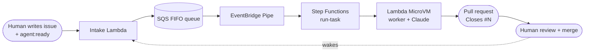

# Overview

## What it is

Salamanda builds software from a backlog of GitHub issues, with no human between the issue and the
pull request.
1. A human writes an issue and approves it by adding the `agent:ready` label.
2. The loop picks it up, and an AI agent implements it in a fresh, isolated machine.
3. The agent opens a pull request.
4. A human reviews and merges it.
5. Merging can make the next issues eligible, and the loop carries on.

The application it builds today is an **expense tracker** (Next.js, under `app/`). The loop itself is
generic: it works on whatever the issues describe.

## Principles

- **Many short runs, not one long agent.** Each run does exactly one issue, then its MicroVM is destroyed.
  A fresh context every time keeps runs cheap, predictable, and easy to debug.
- **Small, testable issues.** An issue should have one clear outcome and a checkable definition of done.
  If the agent finds an issue too big, it files smaller child issues instead of half-doing it.
- **Humans approve both ends.**
  - Nothing is worked on without the `agent:ready` label.
  - Nothing merges without a human, and without the required CI checks passing.
- **A failure never produces a pull request.** It produces a labelled issue with a comment explaining why.
- **The agent can't touch its own guardrails.**
  - Protected paths (CI, infrastructure, the harness, the worker itself) are refused by the agent's tools
    and rejected by a required CI check.
  - The bot's GitHub identity can't edit workflows at all.
- **Always terminate.** Every run's MicroVM is terminated, on success, failure, timeout or crash.

## What a human does

| Human | Loop |
|---|---|
| Writes issues and adds `agent:ready` | Picks the next eligible issue, one run at a time |
| Reviews and merges pull requests | Implements, tests, and opens the PR, or explains a failure |
| Retries a failed issue by re-adding `agent:ready` | Wakes up on labels and merges, and backs off while idle |
| Deploys the infrastructure (`terraform apply`) | Never changes its own infrastructure |

## Where to go next

- [Architecture](architecture.md): the components and a run's life cycle.
- [Writing issues](issues.md): how to feed the loop.
- [Operations](operations.md): how to deploy and control it.
